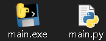
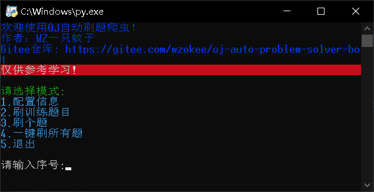
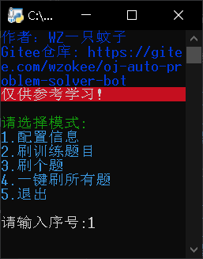
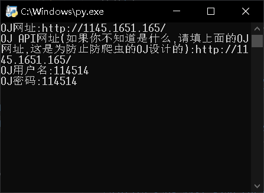
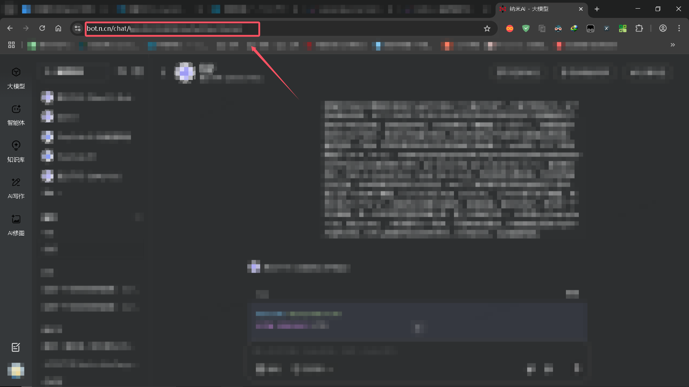
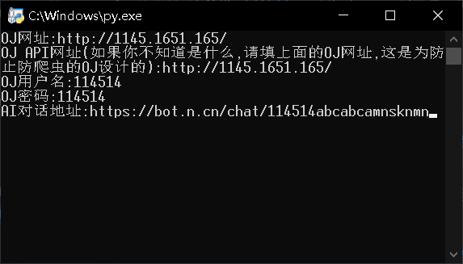
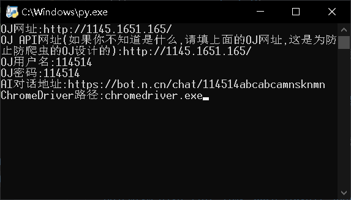

# OJ自动刷题爬虫

#### 此项目已被台设备访问（每ip算一个）

## 介绍

利用AI（ 360bot ）对HOJ类OJ的自动爬虫刷题系统，适配于 $Windows$

## 安装教程

⚠EXE现阶段不稳定，非必要不建议下载

1. 克隆仓库至本地 (下载EXE的忽略)

   ```Shell
   git clone https://gitee.com/wzokee/oj-auto-problem-solver-bot.git
   ```

2. 安装谷歌浏览器

3. 安装谷歌浏览器的对应的爬虫驱动（ chromedriver ）: [下载地址1](https://googlechromelabs.github.io/chrome-for-testing/)、[下载地址2](http://chromedriver.storage.googleapis.com/index.html)

4. 安装 Python 第三方库（ 运行 install_packages.bat ） (下载EXE的忽略)

## 使用说明

1. 打开  main.py  或  main.exe

   

   打开后显示为（主菜单）：

   

2. 配置信息（按照提示操作，之前配置过会保存）

   1. 输入1，回车

      

   2. 输入OJ网址、OJAPI（保留 http:// 或 https:// ）、账号、密码，回车

      

   3. 注册登录[360bot](https://bot.n.cn/)账号，随便建个聊天页面，选择模型，聊一句，复制网址，填入程序内的AI对话地址（保留 http:// 或 https://），回车

      

      

   4. 输入 ChromeDriver 地址（不要套双引号或单引号），回车

      

   5. 在弹出的页面登录 360bot（以获取Cookies自动登录），登录后回车，完成配置，配置会保存在同目录下的 user_data.json

3. 开始刷题（按照提示操作，可刷训练、个题、全部）

## 参与贡献

1. Fork 本仓库

2. 新建 Pull Request

3. 提交 issues

4. Star 本仓库